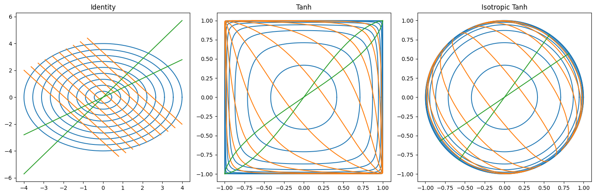

# Isotropic Deep Learning

Isotropic deep learning, coined by George Bird in his [position paper](https://zenodo.org/records/16632905) on the hidden inductive bias of the current deep learning paradigm, sets out to re-think deep learning in terms of symmetries in functional forms. The term "isotropy" means "the same in all directions", while the term "anisotropy" means "not the same in all directions". In this repository, I performed a few experiments on toy datasets using isotropic functional forms with an emphasis on visualizations. This, in turn, may help others learn about this paradigm. 

## Introduction

Historically, local coding was thought to be the working mechanism of representing information in the brain, which inspired our current *anisotropic* deep learning paradigm. This translates to the assumption that individual neural network activations (neurons) encapsulate specific semantics. For example, neuron $n_1$ fires whenever the input image resembles a 'cat', whereas neuron $n_2$ fires whenever a 'dog' is present in the input image. This interpretation of a single neuron has also been termed the *grandmother neuron* or *Jennifer Aniston neuron*, meaning that the level of abstraction of a concept encapsulated in a neuron is quite arbitrary. Local coding is further characterized by assigning a single concept to each neuron. This approach is naturally leads to memory bottlenecks, as $N$ concepts can only be represented by $N$ neurons. 

More research into neuroscience shed light on a different approach - distributed codes, by which the representation of a concept is distributed across all neurons. This acts as the polar opposite of local codes. For example, for $N$ binary neurons, distributed codes allow for a representational capacity of $2^N$. 

It seems that our current anisotropic deep learning paradigm was build upon the former local codes, as the functional activation forms all exhibit element-wise operations. Performing an activation function element-wise to a vector in $\mathbb{R}^d$ that represents neuronal activity implies that the activation function determines the stimulus, or lack thereof, of each neuron in a layer. The position paper posits that these element-wise activation functions hide an inductive bias, best described as the dependence on the standard (kronecker) basis vectors, as shown in multi-variate form below for the hyperbolic tangent function
```math
    f: \mathbb{R}^d \rightarrow \mathbb{R}^d, \qquad f(\mathbf{x}) = \sum_{i=1}^d \tanh(\mathbf{x} \cdot \vec{e}_i) \;\vec{e}_i
```
This basis dependence creates a permutation symmetry, due to the commutative properties of the sum. The permutation invariance is formulation as follows. For any permutation matrix $P$, it holds that
```math
    f(P \mathbf{x}) = P f(\mathbf{x})
```
However, it is argues that anisotropic forms lack rotational symmetries. In other words, the symmetry is broken, formalized by the existance of a rotation matrix $R$ and scalar $c \in \mathbb{R}$, such that 
```math
    f(R \mathbf{x}) \neq c R f(\mathbf{x})
```
The importance of rotational symmetries is extremely useful, because we often measure similarities between vectors by their angle. Therefore, biasing the activation space to be rotation equivariant enables directions to have equal meaning. 



Isotropic activation functions are designed to be rotation equivariant, i.e., for all rotation matrices $R$ and scalar $c \in \mathbb{R}$, 
```math
    f(R \mathbf{x}) = c R f(\mathbf{x})
```
The position paper further hypothesizes that semantic features are better embedded in activation space, which is empirically shown in toy examples.

## Toy Example: Tanh

### Anisotropic

<video src="training_animations/tanh_training_animation.mp4" controls="controls" style="max-width: 730px;">
</video>

### Isotropic

<video src="training_animations/iso_tanh_training_animation.mp4" controls="controls" style="max-width: 730px;">
</video>

## Toy Example: ReLU

### Anisotropic 

<video src="training_animations/relu_training_animation.mp4" controls="controls" style="max-width: 730px;">
</video>

### Isotropic

<video src="training_animations/iso_relu_training_animation.mp4" controls="controls" style="max-width: 730px;">
</video>

## Toy Example 3 class problem: Tanh

### Anisotropic 

<video src="training_animations/multi_tanh_training_animation.mp4" controls="controls" style="max-width: 730px;">
</video>

### Isotropic

<video src="training_animations/multi_iso_tanh_training_animation.mp4" controls="controls" style="max-width: 730px;">
</video>

## Toy Example 3 class problem: ReLU

### Anisotropic 

<video src="training_animations/multi_relu_training_animation.mp4" controls="controls" style="max-width: 730px;">
</video>

### Isotropic

<video src="training_animations/multi_iso_relu_training_animation.mp4" controls="controls" style="max-width: 730px;">
</video>

## MNIST

In the MNIST experiments, it is clear that the 10 digit classes in the $\mathbb{R}^2$ activation space are better distributed, or in some sense, more equally distributed. 

For instance, in the Tanh experiment, whenever a dot product is taken with a latent vector in the isotropic activation space, the alignment between the latent vector and a class is measured without distortions produced by the square shape of the anisotropic Tanh. Moreover, it seems that there is less overlap between classes in activation space. 


As for ReLU, it is clear that isotropy promoted semantic directions for each class, whereas anisotropy clusters some semantics near zero without a proper direction. The former is useful for measuring similarity. Furthermore, besides alignment with a specific semantics via angular measurements, isotropy is said to produce semantic magnitudes that indicate the amount of stimulus present in the semantic. This can be useful in cases where a semantic is continuous, such as age or color. 


